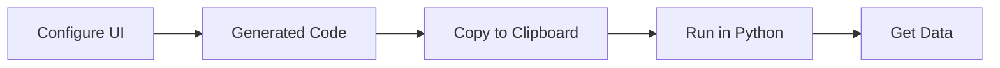

# Code Generator

The **tvscreener Code Generator** is a visual web app that lets you build screener queries without writing code.

[:material-rocket-launch: Launch Code Generator](https://deepentropy.github.io/tvscreener/){ .md-button .md-button--primary }

## Features

- **Visual Filter Builder**: Pick a field, an operator and a value
- **All 6 Screeners**: Stock, Crypto, Forex, Bond, Futures, and Coin
- **Searchable Fields**: Every field of the screener is reachable by search, in filters, columns and sort. Search also matches initials: `rsi` finds Relative Strength Index (14), `sma50` finds Simple Moving Average (50)
- **Timeframes**: Apply `with_interval()` to indicators in filters, columns and sort
- **Markets**: Choose the stock markets to scan with `set_markets()`
- **Real-time Preview**: The Python code updates as you configure. Changed lines flash in the preview
- **Section Highlight**: Hover a section (Filters, Columns, Results) to highlight the code lines it produces
- **One-click Copy**: Copy code to clipboard and run locally

## How It Works



1. **Select a Screener**: Choose Stock, Crypto, Forex, Bond, Futures, or Coin in the tab bar
2. **Add Filters**: Click "Add filter", search a field, choose an operator and type a value
3. **Select Columns**: Tick fields, apply a preset, or use "Select all"
4. **Set Results**: Choose the index (stocks only), sort field, order and number of rows
5. **Copy Code**: Click "Copy code" and paste into your Python environment
6. **Run**: Execute the code to get your data

## Example Workflow

### 1. Select Screener

Click the "Stock" tab (the default).

### 2. Add Filters

Click "Add filter". The field search opens. Type "price", press Enter, then set:

- **Operator**: `>`
- **Value**: 50

Add more filters as needed:

- Volume `>=` 1,000,000
- Relative Strength Index (14) `<` 30

The left border of a filter is green for `>`/`>=` and red for `<`/`<=`.

Operators:

| Operator | Generated code |
|----------|----------------|
| `>` `>=` `<` `<=` `=` `≠` | `ss.where(StockField.PRICE > 50)` |
| between | `ss.where(StockField.PRICE.between(10, 50))` |
| in list | `ss.where(StockField.SECTOR.isin(['Finance', 'Utilities']))` |
| not in list | `ss.where(StockField.SECTOR.not_in(['Finance', 'Utilities']))` |

For list operators, separate the values with commas.

When the field accepts a timeframe, a timeframe box appears next to it. `1D` is the default and adds nothing to the code. Any other value adds `with_interval()`:

```python
ss.where(StockField.RELATIVE_STRENGTH_INDEX_14.with_interval('60') < 30)
```

Timeframe codes: `1m`=`'1'`, `5m`=`'5'`, `15m`=`'15'`, `30m`=`'30'`, `1h`=`'60'`, `2h`=`'120'`, `4h`=`'240'`, `1W`=`'1W'`, `1M`=`'1M'`.

### 3. Select Columns

Use "Select all" for every field, apply a preset, or tick specific ones:

- Name
- Price
- Change %
- Volume
- Relative Strength Index (14)

Selected columns appear as chips, in the order of `ss.select()`. Click a chip to remove it.

When at least one selected column accepts a timeframe, a **Timeframe** box appears. It applies to every column that accepts one; the other columns stay unchanged.

### 4. Set Results

- **Markets**: add one or more markets (stocks only). With no market, the screener uses United States. "All markets" replaces the other markets
- **Index**: S&P 500 (optional, stocks only)
- **Sort by**: Market Capitalization, Desc. A timeframe box appears when the sort field accepts one
- **Rows**: 100

### 5. Copy and Run

The generated code will look like:

```python
from tvscreener import StockScreener, StockField, IndexSymbol

ss = StockScreener()

# Filters
ss.where(StockField.PRICE > 50)
ss.where(StockField.VOLUME >= 1_000_000)
ss.where(StockField.RELATIVE_STRENGTH_INDEX_14 < 30)

# Fields
ss.select(
    StockField.NAME,
    StockField.PRICE,
    StockField.CHANGE_PERCENT,
    StockField.VOLUME,
    StockField.RELATIVE_STRENGTH_INDEX_14
)

# Index
ss.set_index(IndexSymbol.SP500)

# Sort & Limit
ss.sort_by(StockField.MARKET_CAPITALIZATION, ascending=False)
ss.set_range(0, 100)

df = ss.get()
print(df)
```

## Presets

Presets replace the current column selection.

| Screener | Presets |
|----------|---------|
| Stock | Basic, Valuation, Technical, Performance, Dividends |
| Crypto | Basic, Technical, Performance |
| Forex | Basic, Technical |
| Bond, Futures, Coin | Basic |

## Tips

!!! tip "Use Select All for Exploration"
    When exploring available data, use "Select all" to see all ~3,500 fields. You can then narrow down to the fields you need.

!!! tip "Start Simple"
    Begin with one or two filters, verify results, then add more conditions.

!!! tip "Check Field Types"
    Numeric fields support `>`, `<`, `between`. Text fields support `==`, `isin`.

## Limitations

- The Code Generator creates Python code - you still need Python installed to run it
- No backend - all processing happens in your browser
- Generated code requires the `tvscreener` package to be installed

## Feedback

Found a bug or have a feature request?

[Open an Issue on GitHub](https://github.com/deepentropy/tvscreener/issues){ .md-button }
